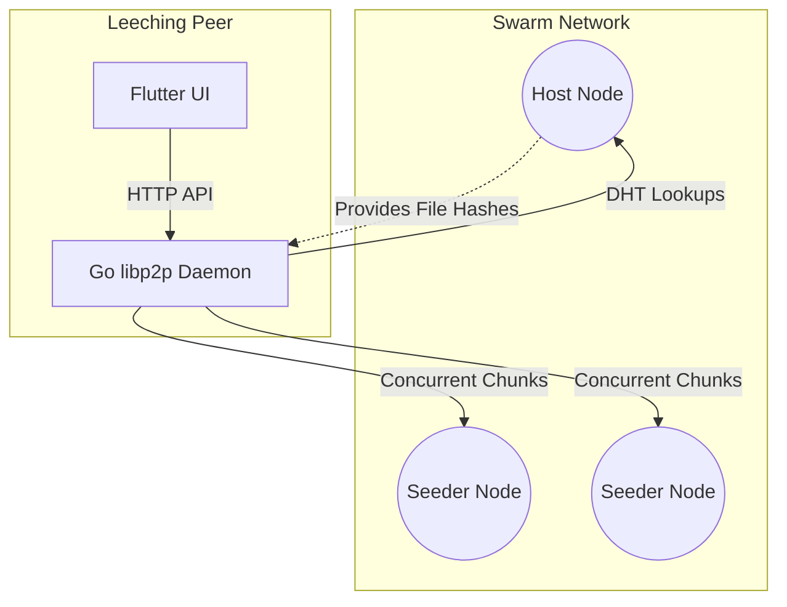

# PeerDrive 🚀

**PeerDrive** is a decentralized, multi-platform, peer-to-peer file sharing application. It enables high-speed, secure file transfers across all your devices using modern Web3 networking principles—no central storage servers required.

By combining the **libp2p** networking stack (used by IPFS) with a modern **Flutter** frontend, PeerDrive creates a seamless BitTorrent-style swarming experience across Desktop, iOS, Android, and Web.

---

## 🌟 Key Features

*   **Multi-Peer Swarming:** Files are broken into 256KB chunks and downloaded concurrently from multiple peers (seeders) in the network, dramatically increasing download speeds.
*   **Per-Chunk Hash Verification:** Every chunk is verified against a master SHA-256 hash list in memory before touching your disk, guaranteeing file integrity.
*   **Cross-Platform Parity:** Works seamlessly on Android, iOS, macOS, Windows, Linux, and the Web.
*   **Decentralized Discovery:** Uses the Kademlia DHT (Distributed Hash Table) to find seeders automatically without centralized trackers.
*   **My Drive Synchronization:** Keep your personal files synced across your laptop, phone, and desktop.
*   **Granular Access Control:** Share files using secure `peerdrive://` links. Revoke access dynamically at any time.

---

## 🏗 Architecture

PeerDrive uses a hybrid architecture consisting of a **Go Daemon** (core networking) and a **Flutter UI**. The Go daemon runs universally (even compiled natively as `.aar`/`.framework` on mobile) and exposes a local REST API that the Flutter UI interacts with.



---

## 🚀 Getting Started

### 1. The Oracle Cloud Web Dashboard
You can try out PeerDrive instantly without installing anything by visiting the web dashboard. Paste a `peerdrive://` link to join a swarm, or create your own share!
* **Web UI:** [peerdrive.hbhanot.tech](https://peerdrive.hbhanot.tech)

### 2. Download for Android
The Android APK is automatically compiled by our CI/CD pipeline.
1. Go to the [Releases Tab](../../releases/latest).
2. Download `app-release.apk` and install it on your Android device.

### 3. Build for iOS / macOS
Apple restricts side-loading, so you must compile the app locally using Xcode:
```bash
git clone https://github.com/Hardikbhanot/PeerDrive.git
cd PeerDrive/mobile
flutter run
```

---

## 🔮 Future Scopes

PeerDrive is an MVP, but the underlying networking architecture is designed for massive scalability. Future roadmap items include:

- [ ] **End-to-End Encryption (E2EE):** Encrypt chunks before transit so that even malicious seeders cannot read the file contents.
- [ ] **WebRTC Support:** Allow standard web browsers (Chrome/Safari) to act as active seeders without needing to run the Go Daemon, enabling true Browser-to-Browser P2P.
- [ ] **NAT Traversal Enhancements:** Implement TURN relays and AutoNAT to allow seamless connections even across strict symmetric corporate firewalls.
- [ ] **Local mDNS Discovery:** Automatically discover and sync with peers on the same WiFi network at gigabit speeds without relying on the global DHT.
- [ ] **Background Syncing:** Leverage OS background tasks to keep "My Drive" synced even when the app is closed.

---
*Built with Go, Flutter, and libp2p.*
